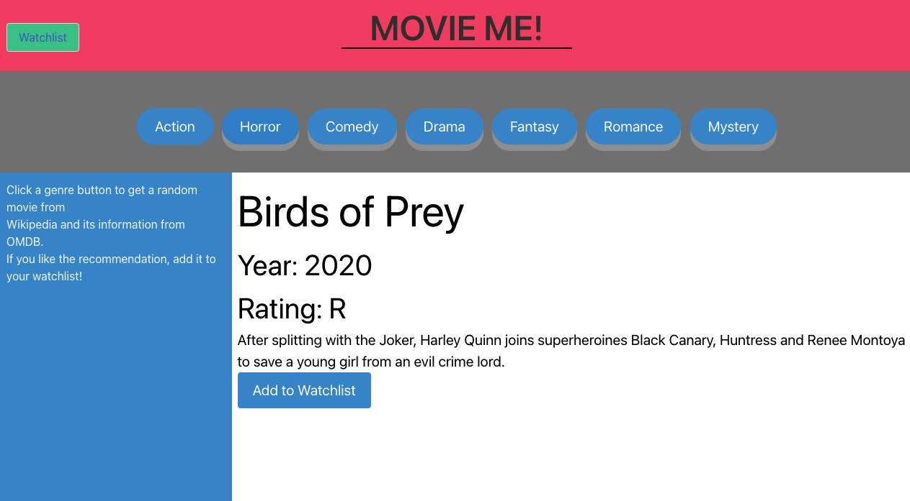

# MOVIE ME!

USER STORY

## AS AN indecisive movie enthusiast

## I WANT to get a movie recommendation based on genre

## SO THAT I can watch a new movie

# Usage

MOVIE ME! is a web application used for getting movie recommendations. Click a genre button, and you will see a movie displayed along with year released, movie rating, and a plot for the movie. The application first calls a Wikipedia API to gather the names of over 100 movies. The click interaction with the genre button calls an Open Movie Database API to gather the rating and plot of the randomly selected movie. These movies can be added to a watchlist which can be viewed at a watchlist webpage. This watchlist is stored using client side storage.

We built this with Open Movie Database API, Wikipedia API, HTML, JavaScript, CSS, and Bulma CSS library.

Please submit an issue if you see a bug or a suggested improvement.

## Deployment

https://josh2100.github.io/movie-me/

## Screenshot

## Credits

Created by Joshua Schermann, Henry Olson, and Abdirizak Mohamed. Special thanks to Wikipedia, Open Movie Database, and Bulma for sharing their data.
